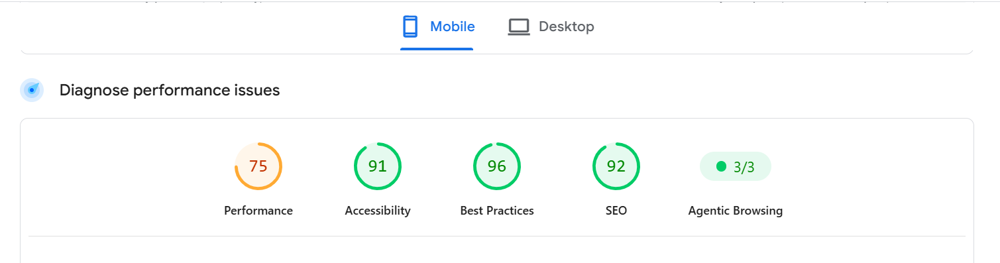

# FE-10 Accessibility and Performance Audit

## Audit Overview

This audit was performed on the deployed `/3d` experience of the Frontend AI Capstone using Chrome/PageSpeed Insights and WAVE.

The goal was to evaluate performance, accessibility, keyboard navigation, and accessibility considerations for the interactive 3D experience.

---

## Lighthouse / PageSpeed Results

### Before

| Category | Score |
|---|---:|
| Performance | 75 |
| Accessibility | 91 |
| Best Practices | 96 |
| SEO | 92 |

### After

| Category | Score |
|---|---:|
| Performance | 82 |
| Accessibility | 91 |
| Best Practices | 96 |
| SEO | 92 |

### Performance Improvement

Performance improved from **75 to 82**, a gain of **7 points**.

The final Performance score of 82 is above the assignment's absolute minimum requirement of 80, although it remains below the recommended target of 90.

---

## Core Web Vitals / Performance Metrics

The final performance audit reported:

- First Contentful Paint (FCP): **3.3 s**
- Largest Contentful Paint (LCP): **3.8 s**
- Total Blocking Time (TBT): **0 ms**
- Cumulative Layout Shift (CLS): **0**
- Speed Index: **3.3 s**

The zero CLS and zero TBT results indicate that the page avoided measurable layout shifting and main-thread blocking during this audit run.

---

## Performance Changes

The 3D experience was kept lightweight by using simple box geometry rather than a large external 3D model.

Mobile rendering uses a lower device-pixel-ratio range:

- Desktop: `dpr={[1, 2]}`
- Mobile: `dpr={[1, 1.5]}`

OrbitControls damping is disabled on mobile to reduce rendering overhead.

The implementation also respects the user's reduced-motion preference. When `prefers-reduced-motion: reduce` is enabled, a static fallback is displayed instead of the WebGL scene.

---

## Accessibility Audit

### WAVE Result

The WAVE audit initially reported:

- Errors: **1**
- Contrast Errors: **0**
- Alerts: **1**
- Features: **0**
- Structural Elements: **1**
- ARIA: **0**

The WAVE report identified:

1. Language missing or invalid
2. No page regions
3. One H1 heading

The document language was verified as:

```html
<html lang="en">

### Before Screenshot



### After Screenshot

